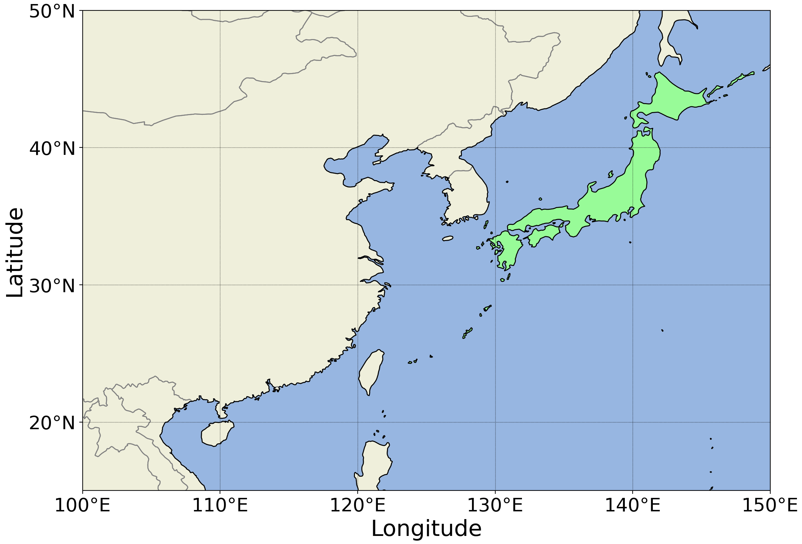

# What is this?
cartopy のラッパークラスで、地図を描画する際の操作を補助するライブラリ

# install
```Bash
pip install git+https://github.com/7304sk/cartooff
```

# 利用方法
example.py を参照  
cartooff.py をライブラリパスの通ったディレクトリか、実行用ファイルの同一ディレクトリ内に設置する
```python
from cartooff import cartooff
```
matplotlib としての fig, ax (axin) はそれぞれ全てインスタンス変数として作成されているため、cf.fig や cf.ax のようにインスタンスからアクセスが可能。  
そのため、既存の matplotlib や cartopy の関数もそのメソッドとして利用が可能。  
```python
# 例： shape データを他で用意すれば以下のように自由に操作可能
cf = cartooff()
cf.draw(longitude, latitude, resolution)
cf.ax.add_feature(shape)
```
cartopy の NaturalEarhFeature から、陸地、海、国境の shape は draw を実行時に自動で取得し、インスタンス変数 land, ocean, countries に保存されている。
```python
# 例2： axin にも広域図と同じものを描画
cf = cartooff()
cf.draw(longitude, latitude, resolution)
cf.add_inset_map(inset_extent)
cf.axin.add_feature(cf.land)
cf.axin.add_feature(cf.ocean)
cf.axin.add_feature(cf.countries)
cf.axin.coastlines(resolution=cf.resolution)
```
cartopy の crs サブクラスを指定することで地図投影法を設定可能。  
第二引数以降にはその投影法クラスの引数を指定することで展開されて設定される。  
注意点として、デフォルトの正距円筒図法（PlateCaree）以外の図法では add_inset_map の indicator がバグるため自動でオフになる。
```python
# 例3： 中心軽度160度のメルカトル図法に設定
#      第一引数に渡すのはクラスであってインスタンスではならないので、ccrs.Mercator() のように () をつけてはならない
import cartopy.crs as ccrs
cf = cartooff(ccrs.Mercator, central_longitude=160)
```